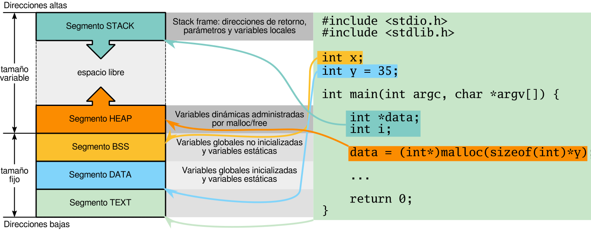

Estructura:
    Una estructura es uan coleccion de variables de distintos tipos , agrupadas bajo un mismo nombre 

Puntero: 
    Un puntero es una variable que almacena una direccion de memoria

Como declarar un puntero:

int*p; // un puntero que apunta a cualquier lado (contenido basura)

Como declarar y asignar un puntero:
int x =123;
int* pointer = &x; // ya arranca apuntando a esa direccion de memoria

Como desreferenciar un puntero,es decir, como mostrarme el dato de la direccion de memoria que tiene mi puntero.
*pointer 

Punteros void: 

void*
Un caso particular de punteros es void*, que es un puntero genérico. Sirve para almacenar
una dirección de memoria de cualquier tipo, pero no se puede desreferenciar directamente. ¿Para
qué tener un puntero genérico? Bueno, es útil cuando no sabemos de antemano el tipo de dato al
que va a apuntar el puntero. Por ejemplo, en funciones que pueden recibir punteros a diferentes
tipos de datos, como malloc o free, que veremos más adelante.
La ventaja es que un void* puede apuntar a cualquier tipo de dato, pero la desventaja es que
no podemos realizar operaciones aritméticas directamente con él. Para usar un puntero void*,
debemos convertirlo al tipo de puntero adecuado antes de usarlo. Por ejemplo:

void* ptr;
int x = 42;
ptr = &x; // ptr apunta a la dirección de x
// Convertir el puntero void* a un puntero int*
int* p = (int*)ptr; // casting 
printf("Valor: %d\n", *p); // Imprime 42

Errores Comunes:

Segmentation Fault: Trataste de acceder a una direccion de memoria invalida

Punteros a Null: Se usa cuando queremos que el puntero no apunte a nada. 

Aritmetica de punteros: 

cuando a un puntero le sumamos un uno, hace lo que valia antes + 1 * (tipo del puntero en bytes)

p[n] == *(p+n)

Punteros como Argumentos: es mejor porque no se pasan por copia, y hay veces que queremos jugar directamente con la memoria.

Tipos de Memoria: Entender los tipos de memoria es fundamental para entender C.

Memoria de código: es la memoria que se reserva para almacenar el código del programa.
Su tamaño no puede cambiar durante la ejecución del programa. Es de solo lectura. Se
define en el text segment del programa.

Memoria automática: es un tipo de memoria que se reserva en el momento de la eje-
cución. Las variables locales se almacenan en esta memoria. Su tamaño puede cambiar
durante la ejecución del programa. Es el llamado stack o pila, es de lectura y escritura. 

Memoria estática: es la memoria que se reserva en el momento de la compilación. Las
variables globales y estáticas se almacenan en esta memoria. Su tamaño no puede cambiar
durante la ejecución del programa. Se definen en el data segment del programa, es de lectura y escritura, DATA SEGMENT.

Memoria dinámica: es la memoria que se reserva en el momento de la ejecución, pero
su tamaño puede cambiar durante la ejecución del programa. Se utiliza para almacenar
datos que no se conocen en tiempo de compilación. Es el llamado heap.

Linkage: "El linkage de un simobolo (variable o funcion) es la forma en que es accesible desde diferentes archivos o moduos"
|- 3 tipos de Linkage:
    - Interno : El simbolo es accesible solo dentro del archivo.    
    - Externo : El simbolo es accesible desde cualquier archgivo que incluya su declaracion
    - No-Linkage: El simbolo no tiene linkage, no es accesible fuera de su scope
    
+----------------------------------------+-----------------+----------------------------+-----------------+
|                Scope                  |     Lugar      |        Duración            |     Linkage     |
+----------------------------------------+-----------------+----------------------------+-----------------+
| Global (a toda la aplicación)         | data segment   | Todo el tiempo de la app   | externo         |
| Global (al archivo)                   | data segment   | Todo el tiempo de la app   | interno         |
| Local a la función o bloque (estática)| data segment   | Todo el tiempo de la app   | no linkage      |
| Local a la función o bloque (auto)    | stack          | Mientras la función viva   | no linkage      |
| Dinámica                              | heap           | Hasta liberar la memoria   | no linkage      |
+----------------------------------------+-----------------+----------------------------+-----------------+

Memoria Dinamica: Se reserva en el heap y es la que se utiliza para almacenar datos que no se conocen en tiempo de compilacion.

Tenemos distintos tipos de funciones: 
- malloc : Reserva un bloque de memoria de un tamano especifico y devuelve un puntero a esa direccion de memoria, no se inicializa, es decir, esta con basura.   
- calloc : Reserva un bloqeu de memoria para un numero especifico de elementos de un tamano especifico y devuelve un puntero a la direccion de memoria reservada, y se inicializa en cero. 
- realloc: Cambia el tmano de un bloque de memoria previamente reservado y devuelve un puntero a la nueva direccion de memoria, si la nueva direccion es diferente, la memoria anterior se libera.
- free: libera un bloque de memoria previamente reservado. 

void* malloc(size_t size);
void* calloc(size_t num, size_t size);
void* realloc(void* ptr, size_t size);
void free(void* ptr);
Estas declaraciones se encuentran en stdlib.h

El operador -> se usa para acceder a lois miembros de una estructura a traves un puntero.

Organizacion de la memoria: 

Punteros a punteros: 

int**: puntero (int**) a un puntero a un entero (int**)

void**: puntero a puntero a un tipo desconocido. No se puede desreferenciar sin antes
especificar su tipo mediante un casteo.

